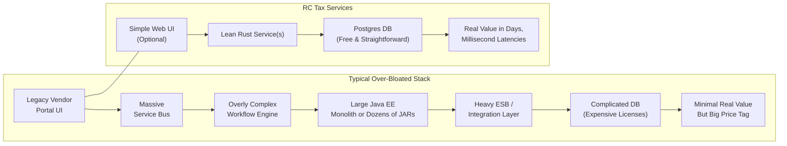

# RC Tax Services

**A minimal, high-performance property tax service and load test—built in just a couple nights as a middle finger to bloated “enterprise” solutions that have overcharged government agencies for decades.**

## Overview

Many government offices get saddled with overpriced, needlessly complex systems. Our goal: **prove** you can build a **lean, maintainable** microservice for property taxes (or similar use cases) in a matter of days—not months—while achieving **millisecond** response times under massive load.

This repository showcases:
- A **Compute** service (handling property records + DB inserts)
- An **Ingest** service (optional WebSocket-based pipeline)
- A **Loadtest** service (Rust-based)  
- An **alternative K6** script for advanced scenario-based testing

All coded swiftly to highlight that huge vendor solutions often **overpromise** and **underdeliver**, while simpler approaches can get the job done faster, cheaper, and more efficiently.

---

## Bloat vs. Lean (Mermaid Diagram)

Below is a **Mermaid** diagram comparing a typical **over-bloated** enterprise approach vs. **RC Tax Services**’ lean design:



**What It Shows**:
- **Over-Bloated**: A typical high-level architecture from big vendors, with a labyrinth of bus layers, huge licensable components, and multiple frameworks—leading to complex, slow, and overpriced solutions.  
- **RC Tax Services**: A minimal approach—a Rust microservice or two, straightforward Postgres DB, optional Web UI or ingestion. Built in **days**, sub-10ms latencies under thousands of RPS.

---

## Why This Approach

1. **Frustration with Bloat**  
   Big corps keep delivering monstrous solutions to gov agencies at sky-high prices—often with slow UIs, countless layers, and minimal real optimization.  
2. **Show, Don’t Tell**  
   In a couple nights, we coded these services from scratch, achieving sub-10ms latencies and thousands of requests per second, on minimal hardware.  
3. **Simplicity**  
   Rust microservices + straightforward DB schema—no endless vendor “integration.”  
4. **Scalability**  
   Our K6 scripts ramp up to hundreds of Virtual Users and attempt 1,000+ RPS. The system soaks it easily with near-zero errors.

---

## Usage (Local)

1. **Clone** the repo:
   ```bash
   git clone https://github.com/copyleftdev/rc-tax-services.git
   cd rc-tax-services
   ```

2. **Run** via Docker Compose:
   ```bash
   docker compose build
   docker compose up
   ```
   - **db** container: Postgres on port 5432  
   - **compute** container: Microservice on port 8080  
   - **ingest** container: WebSocket-based ingress on port 3000  
   - **loadtest** container: A quick, integrated Rust-based load test.

3. **Check** logs. You’ll see `compute` and `ingest` spin up, plus load test results if enabled.

### K6 Testing

- Install [k6](https://k6.io/docs/getting-started/installation/).  
- Then run:
  ```bash
  cd loadtest/
  BASE_URL=http://localhost:8080 k6 run k6_test.js
  ```
  - or if you want to push extreme concurrency:
  ```bash
  BASE_URL=http://localhost:8080 k6 run extremeLoadTest.js
  ```
- Observe latencies, RPS, error rates in console output.

---

## Recent Extreme Load Test Results

**Example**: We ramped to 500 Virtual Users, then hammered 1,000 RPS:

```
=== LOADTEST RESULTS ===
Total Requests: 874,420
RPS: ~2,428
Avg Latency: ~2.71ms (p95 ~6.96ms)
Errors: 0%
```

No errors, sub-7ms 95th percentile—even at thousands of requests per second—**no meltdown** or big overhead.

---

## Key Takeaways

1. **Lean > Bloated**: A simpler microservice can handle high concurrency with minimal overhead.  
2. **Fast Delivery**: Built in two nights—contrasting months-long vendor solutions.  
3. **Cost**: Lower dev hours, minimal hardware, zero licensing nightmares.  
4. **Performance**: Sub-10ms latencies for 95% of requests, scaling to thousands RPS.

---

## Disclaimer

- **Prototype**: Not fully production-grade (no advanced auth, multi-region DB, etc.).  
- **Scaling**: For truly massive traffic, add caching, replication, or advanced logic.  
- **Real Data**: Adjust field definitions for real government/agency needs.

---

## Conclusion

**rc-tax-services** is a **middle finger** to the idea that only huge, overpriced software can serve government agencies effectively. **Yes**, you can do better: simpler architecture, Rust or similarly efficient languages, direct Postgres usage, and thorough load testing for blazing-fast solutions on modest hardware—**in just days**.

Stop overpaying for bloated solutions. **Build something lean**, test thoroughly, and spare your government agency from endless money pits.
